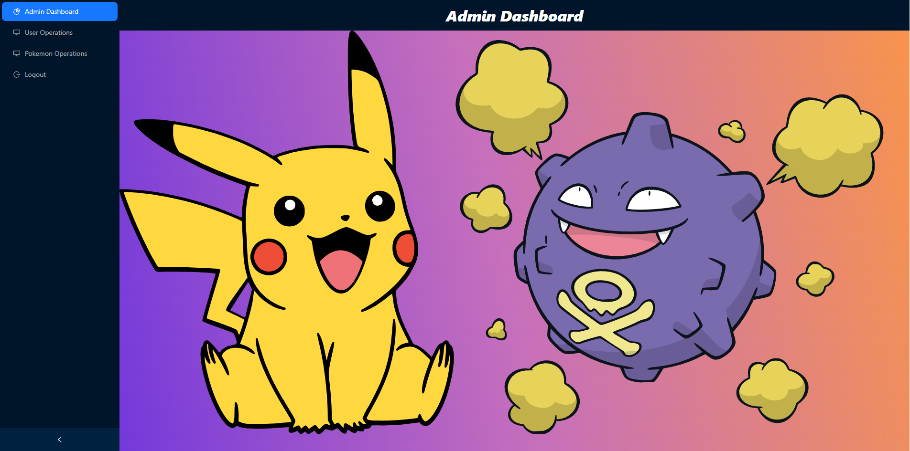
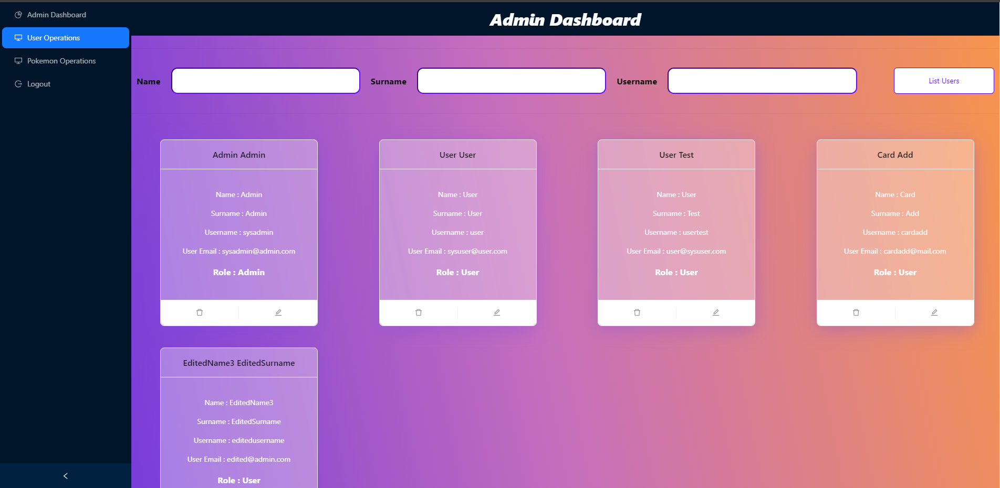
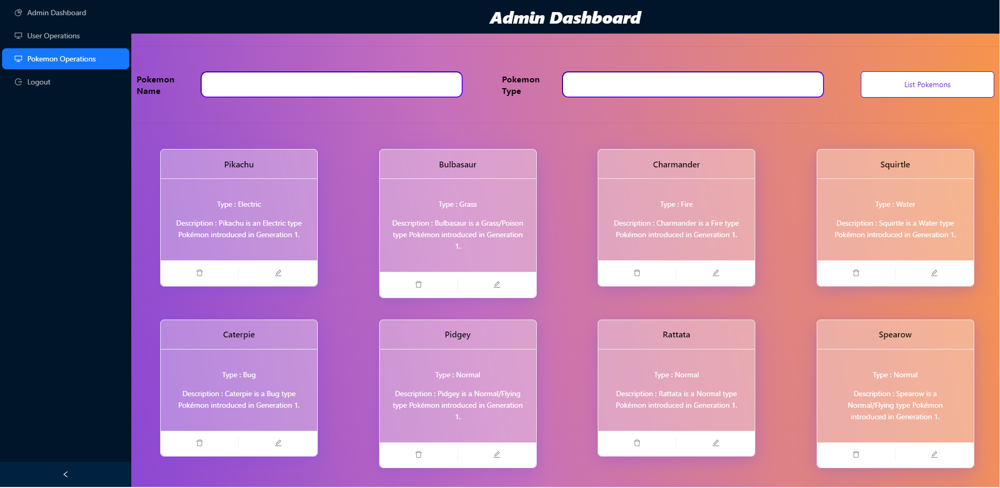
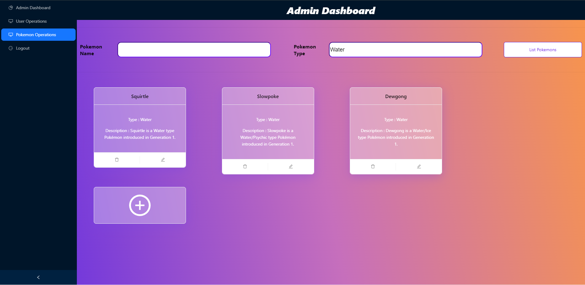
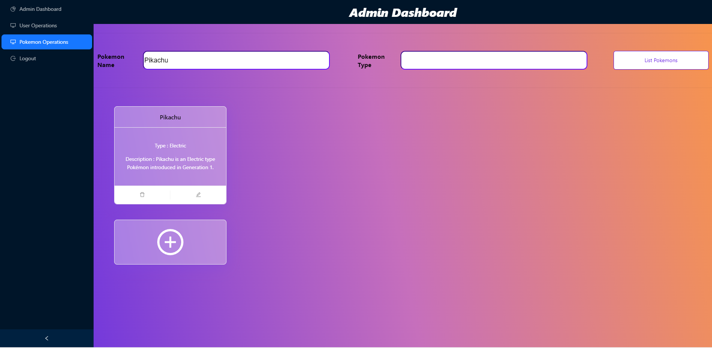
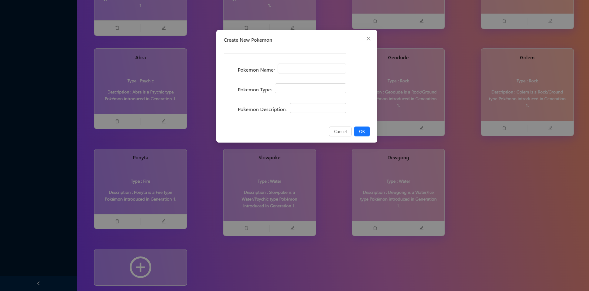

# Pokedex App 
- Web App that allows to see the List of Pokemons, and add Pokemons into Catchlist or Wishlist for Users role.
- Also allows add, edit and delete Users and Pokemons for Admin role.

## Main Page

For Admins, the main page of the app is shown below.

## Users Page

For Admins, User Operations Page allows the admin to add, delete or edit Pokemons.

## Pokemons Page

For Admins, Pokemon Operations allows the admin to add, delete or edit Pokemons.

### Filter Pokemon Page

There are 2 text fields for Admins to filter the Pokemon List. Use case for both filters are shown below.

- Filter by Type

- Filter by Name
  

### Add New Pokemon

A Card-like button is added to the end of the Pokemon List for adding a new Pokemon. 
That button triggers a pop-up for basic information about the new Pokemon.

